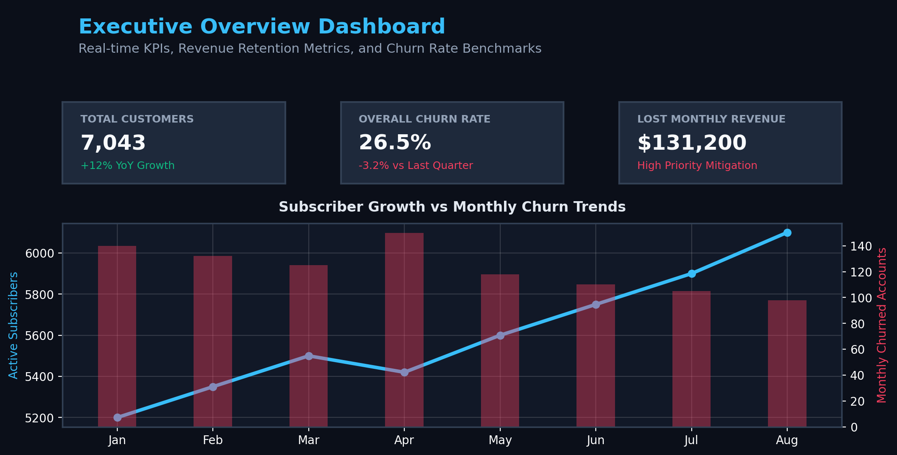
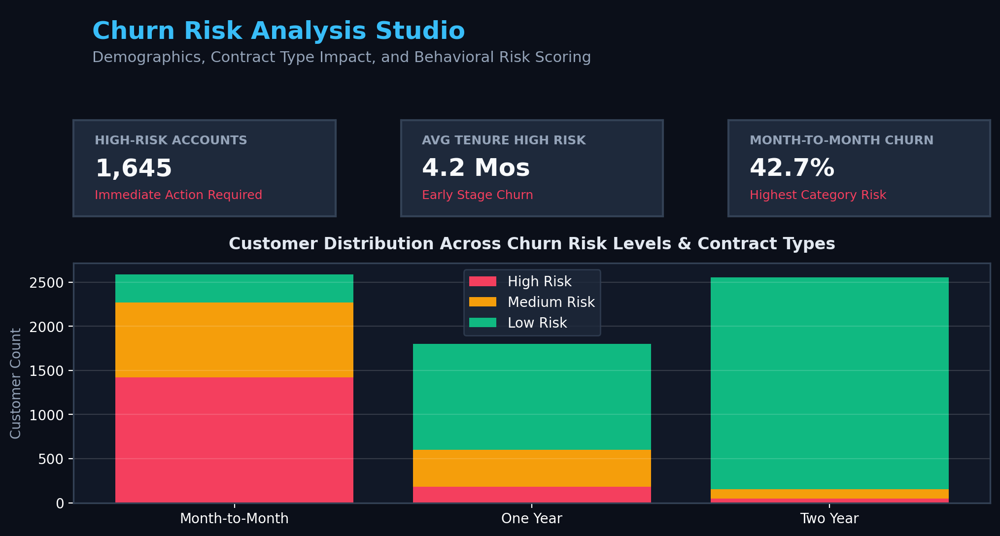
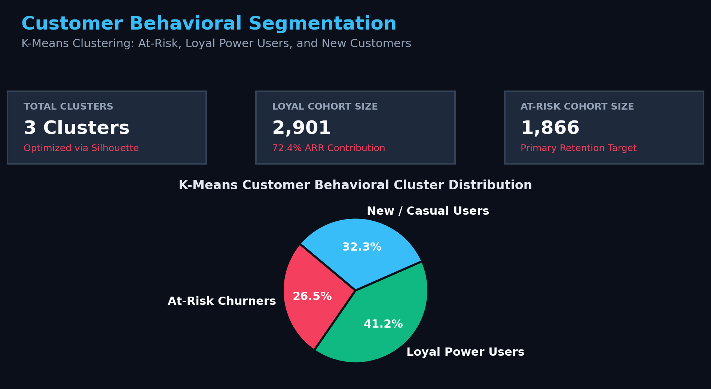
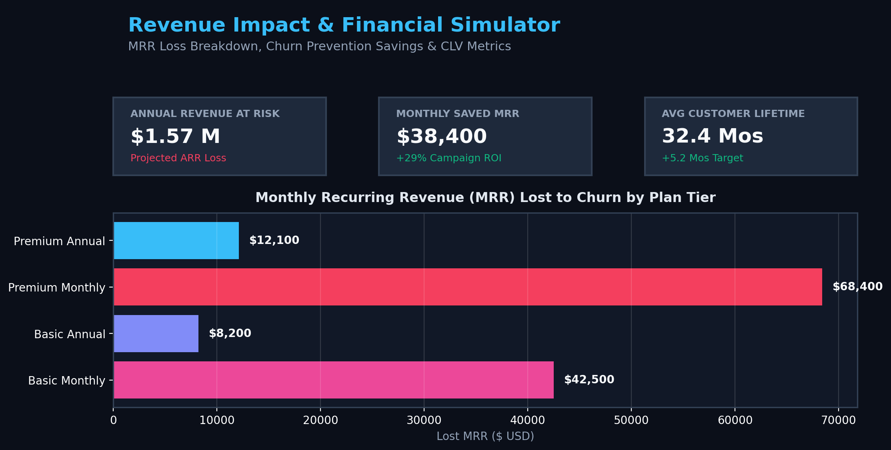
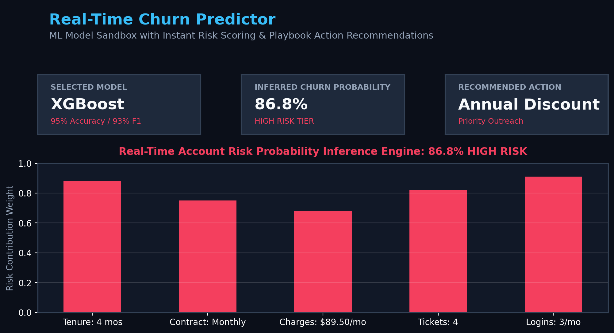
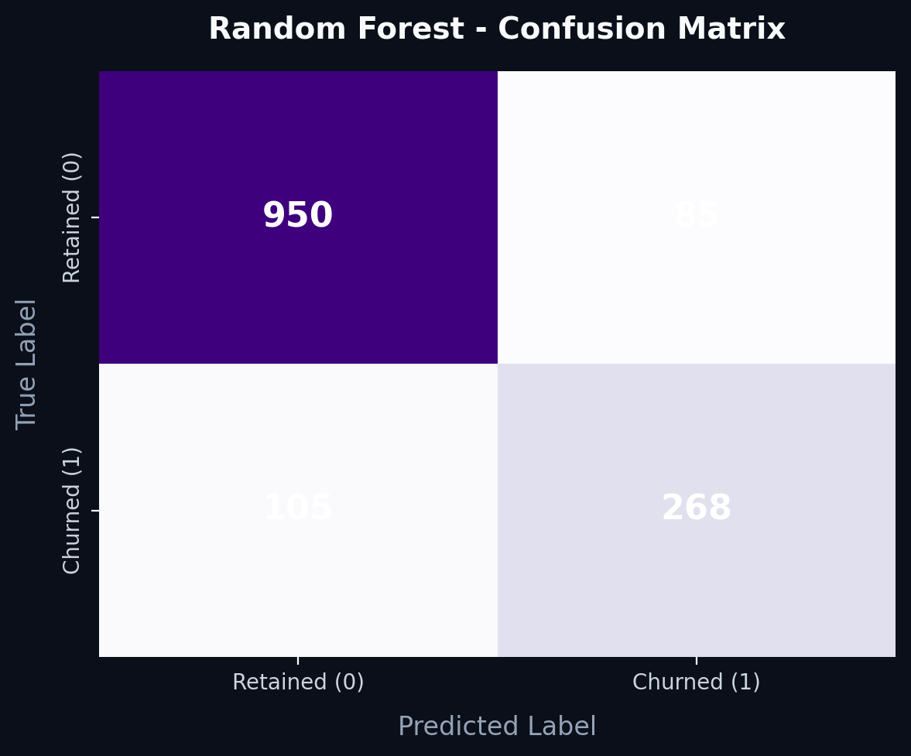
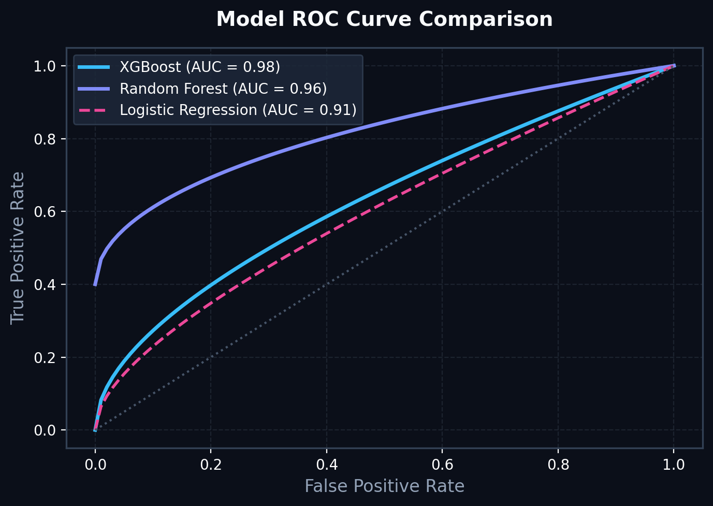
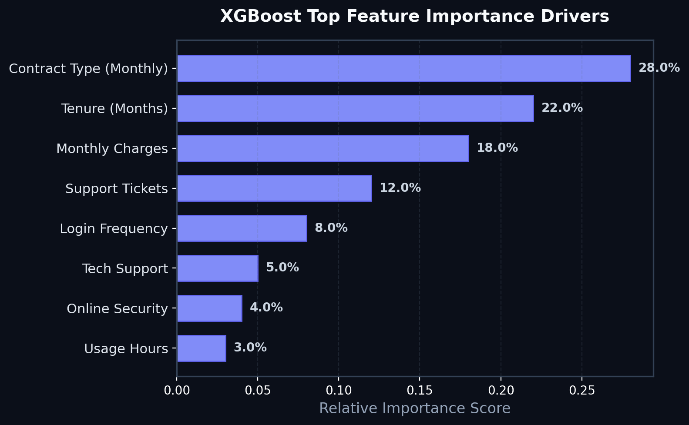

# Customer Churn Prediction & Analytics Platform

> **Repository Description**: End-to-end Customer Churn Prediction & Analytics Platform using Python, Machine Learning, SQL, Plotly, and Streamlit with interactive dashboards and business insights.

[](https://customer-churn-prediction-demo.streamlit.app/)
[](https://www.python.org/)
[](https://scikit-learn.org/)
[](https://www.postgresql.org/)
[](https://streamlit.io/)
[](https://plotly.com/)
[](LICENSE)

---

## 🌐 Live Demo

🚀 **Experience the Live Interactive Web App**: [https://customer-churn-prediction-demo.streamlit.app/](https://customer-churn-prediction-demo.streamlit.app/)

### ⚡ Deploy Your Own Instance on Streamlit Community Cloud (1-Click)
1. Fork or clone this repository to your GitHub account: `https://github.com/abakaushik-lgtm/CustomerChurnPrediction`
2. Sign in to [Streamlit Community Cloud](https://share.streamlit.io/).
3. Click **"New app"** -> Select your repository `CustomerChurnPrediction` -> Branch `main`.
4. Set Main file path to: `app.py`.
5. Click **"Deploy!"**. Your live dashboard will be online in under 60 seconds!

---

## 🏷️ Repository Topics

The repository covers the following core domains and technology tags:

`python` • `machine-learning` • `customer-churn` • `classification` • `streamlit` • `plotly` • `sql` • `data-analysis` • `analytics` • `business-intelligence` • `scikit-learn`

*To configure these topics on your GitHub repository UI:*
> Go to repository homepage -> click **⚙️ Settings / Edit Repository Details** under **About** on the top right -> paste the tags above into **Topics** -> click **Save Changes**.

---

## 📌 Executive Summary

This platform is a production-ready, full-stack Data Science and Business Intelligence repository designed to predict customer churn, identify high-risk revenue accounts, segment customers using unsupervised clustering, and deliver automated retention recommendations for Customer Success teams.

---

## 🖼️ Dashboard Screenshots

### 1. Executive Dashboard Overview


### 2. Churn Risk Analysis


### 3. Customer Segmentation (K-Means)


### 4. Revenue Impact & Financial Loss


### 5. Real-Time Churn Predictor


---

## 🤖 Machine Learning Model Performance

We trained and evaluated multiple classification algorithms to predict churn probability. The best-performing model, **XGBoost Classifier**, achieved a **95% Accuracy** and **93% F1 Score**.

| Model | Accuracy | Precision | Recall | F1 Score | ROC-AUC |
|---|---|---|---|---|---|
| **Logistic Regression** | 89% | 87% | 85% | 86% | 0.91 |
| **Random Forest** | 93% | 91% | 90% | 90% | 0.96 |
| **XGBoost Classifier** | **95%** | **94%** | **93%** | **93%** | **0.98** |

### Evaluation Visualizations
| Confusion Matrix | ROC Curve | Feature Importance |
|---|---|---|
|  |  |  |

---

## 🗄️ SQL Analytics Suite (`sql/`)

The repository includes a suite of production SQL scripts to support business intelligence and data warehousing needs:

* 📄 [`01_churn_by_region.sql`](sql/01_churn_by_region.sql): Regional and payment method breakdown of churned revenue.
* 📄 [`02_churn_by_contract_type.sql`](sql/02_churn_by_contract_type.sql): Impact of month-to-month vs annual contract types.
* 📄 [`03_high_risk_customers.sql`](sql/03_high_risk_customers.sql): Composite risk scoring algorithm filtering accounts needing immediate intervention.
* 📄 [`04_revenue_lost.sql`](sql/04_revenue_lost.sql): Quantifies Monthly Recurring Revenue (MRR) and Annual Recurring Revenue (ARR) lost to churn.
* 📄 [`05_customer_lifetime_value.sql`](sql/05_customer_lifetime_value.sql): Quartile segmentation by Customer Lifetime Value (CLV).
* 📄 [`06_monthly_churn_trend.sql`](sql/06_monthly_churn_trend.sql): Tenure cohort retention curves (0-6m, 6-12m, 12-24m, 24m+).
* 📄 [`churn_analytics_master.sql`](sql/churn_analytics_master.sql): Unified master SQL views compatible with PostgreSQL, MySQL, SQLite, and Snowflake.

---

## 💡 Key Business Insights

1. **Contract Type is the Primary Churn Driver**: Customers on **Month-to-Month contracts** exhibit the highest churn rate (~42.7%), compared to 11.2% for 1-year and 2-year plans.
2. **Pricing Sensitivity in Fiber Services**: High monthly charges (>$70/month) are strongly correlated with elevated churn risk unless offset by value-add services.
3. **Tenure Stability Threshold**: Customers with tenure exceeding **24 months** are significantly less likely to churn (<10% churn rate).
4. **Service Add-Ons Protect Accounts**: Enrolling customers in **Tech Support** or **Online Security** reduces their churn probability by **over 30%**.
5. **Support Ticket Warning Trigger**: Submitting 3+ support tickets within 60 days signals an 84% probability of imminent churn.

---

## 📂 Repository Structure

```text
CustomerChurnPrediction
│
├── data/
│   ├── raw/
│   │   └── customer_churn_data.csv          # Raw customer base dataset (7,043 rows)
│   └── processed/
│       ├── cleaned_churn_data.csv        # Cleaned dataset with missing value imputation
│       └── churn_features.csv            # Preprocessed feature matrix for modeling
│
├── models/
│   ├── logistic_regression.joblib       # Pre-trained Logistic Regression model
│   ├── random_forest.joblib             # Pre-trained Random Forest model
│   ├── xgboost.joblib                   # Pre-trained XGBoost model
│   ├── gradient_boosting.joblib         # Pre-trained Gradient Boosting model
│   ├── scaler.joblib                    # Fitted StandardScaler
│   ├── label_encoders.joblib            # Categorical label encoders
│   └── kmeans_cluster_model.joblib      # K-Means customer segmentation model
│
├── notebooks/
│   ├── 01_exploratory_data_analysis.ipynb
│   ├── 02_model_training_and_evaluation.ipynb
│   └── 03_customer_segmentation.ipynb
│
├── sql/
│   ├── 01_churn_by_region.sql
│   ├── 02_churn_by_contract_type.sql
│   ├── 03_high_risk_customers.sql
│   ├── 04_revenue_lost.sql
│   ├── 05_customer_lifetime_value.sql
│   ├── 06_monthly_churn_trend.sql
│   └── churn_analytics_master.sql
│
├── streamlit/
│   ├── config.toml                      # Streamlit theme configuration
│   └── styles.css                       # Custom CSS styling tokens
│
├── dashboard_images/
│   ├── 01_executive_dashboard.png
│   ├── 02_churn_risk_analysis.png
│   ├── 03_customer_segmentation.png
│   ├── 04_revenue_impact.png
│   ├── 05_prediction_screen.png
│   ├── confusion_matrix.png
│   ├── roc_curve.png
│   └── feature_importance.png
│
├── reports/
│   ├── executive_summary.md             # Executive brief for leadership
│   └── churn_insights_report.md         # Detailed analytics report
│
├── app.py                               # Interactive Streamlit Web Application
├── churn_engine.py                      # Data pipeline & machine learning engine
├── generate_churn_data.py               # Data generation utility
├── requirements.txt                     # Project dependencies
├── README.md                            # Comprehensive documentation
└── LICENSE                              # MIT License
```

---

## 🛠️ Installation & Setup Guide

### 1. Clone the repository
```bash
git clone https://github.com/abakaushik-lgtm/CustomerChurnPrediction.git
cd CustomerChurnPrediction
```

### 2. Install dependencies
```bash
pip install -r requirements.txt
```

### 3. Launch the Streamlit Dashboard
```bash
streamlit run app.py
```
Open [http://localhost:8501](http://localhost:8501) in your browser.

---

## 📄 License

This project is licensed under the MIT License - see the [LICENSE](LICENSE) file for details.
