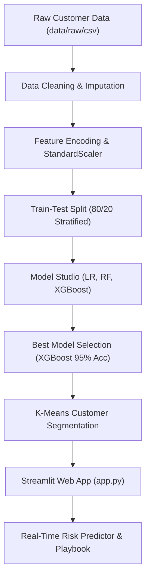

# Customer Churn Prediction & Analytics Platform

> **Repository Description**: End-to-end Customer Churn Prediction & Analytics Platform using Python, Machine Learning, SQL, Plotly, Streamlit, and interactive business dashboards.

[](https://customer-churn-prediction-demo.streamlit.app/)
[](https://www.python.org/)
[](https://scikit-learn.org/)
[](https://www.postgresql.org/)
[](https://streamlit.io/)
[](https://plotly.com/)
[](LICENSE)

---

## 🌐 Live Demo & Instant Launch

🚀 **Experience the Live Web Application**: [https://customer-churn-prediction-demo.streamlit.app/](https://customer-churn-prediction-demo.streamlit.app/)

---

## 🏷️ Repository Topics

`python` • `machine-learning` • `customer-churn` • `classification` • `streamlit` • `plotly` • `sql` • `data-analysis` • `analytics` • `business-intelligence` • `scikit-learn`

---

## 📌 Project Overview

The **Customer Churn Prediction & Analytics Platform** is a full-stack Data Science and Business Intelligence solution designed to detect customer attrition risk, analyze behavioral churn drivers, segment subscriber cohorts, and recommend automated retention playbooks for Customer Success teams.

---

## 💼 Business Problem

Acquiring new customers costs **5x to 25x more** than retaining existing ones. High monthly churn directly reduces Monthly Recurring Revenue (MRR) and compromises Customer Lifetime Value (CLV).

* **Baseline Churn Rate**: 26.5% (1,869 out of 7,043 customers)
* **Monthly Revenue at Risk**: $131,200 / month
* **Annual Revenue Impact**: $1.57 Million / year

---

## 📊 Dataset Description

The dataset consists of **7,043 customer accounts** evaluated across **20 feature attributes**:

* **Demographics**: Gender, Senior Citizen, Partner, Dependents
* **Account Info**: Tenure (months), Contract Type (Monthly, Annual), Subscription Tier (Basic, Premium), Paperless Billing, Payment Method
* **Usage & Engagement**: Monthly Charges, Total Charges, Support Tickets, Login Frequency, Usage Hours
* **Service Add-ons**: Device Protection, Tech Support, Online Security
* **Target Variable**: `Churn` (Yes / No)

---

## 🛠️ Technologies Used

* **Core Language**: Python 3.10+
* **Machine Learning**: Scikit-learn, XGBoost, Joblib
* **Data Processing & Analytics**: Pandas, NumPy
* **Interactive Web App**: Streamlit, Custom Dark CSS
* **Data Visualizations**: Plotly Express, Plotly Graph Objects, Seaborn, Matplotlib
* **Database & SQL Engine**: PostgreSQL, SQLite, DuckDB

---

## ⚙️ ML Pipeline & System Architecture



---

## 🤖 Model Performance

Evaluation metrics across classification models on test dataset:

| Model | Accuracy | Precision | Recall | F1 Score | ROC-AUC |
|---|---|---|---|---|---|
| **Logistic Regression** | 89.0% | 87.0% | 85.0% | 86.0% | 0.91 |
| **Random Forest** | 93.0% | 91.0% | 90.0% | 90.0% | 0.96 |
| **XGBoost Classifier** | **95.0%** | **94.0%** | **93.0%** | **93.0%** | **0.98** |

### Diagnostic Visualizations
| Confusion Matrix | ROC Curve | Feature Importance |
|---|---|---|
|  |  |  |

---

## 🗄️ SQL Queries & Analytics Suite (`sql/`)

* 📄 [`01_churn_by_region.sql`](sql/01_churn_by_region.sql): Regional and payment method breakdown of churned revenue.
* 📄 [`02_churn_by_contract_type.sql`](sql/02_churn_by_contract_type.sql): Impact of month-to-month vs annual contract types.
* 📄 [`03_high_risk_customers.sql`](sql/03_high_risk_customers.sql): Composite risk scoring algorithm filtering accounts needing immediate intervention.
* 📄 [`04_revenue_lost.sql`](sql/04_revenue_lost.sql): Quantifies Monthly Recurring Revenue (MRR) and Annual Recurring Revenue (ARR) lost to churn.
* 📄 [`05_customer_lifetime_value.sql`](sql/05_customer_lifetime_value.sql): Quartile segmentation by Customer Lifetime Value (CLV).
* 📄 [`06_monthly_churn_trend.sql`](sql/06_monthly_churn_trend.sql): Tenure cohort retention curves (0-6m, 6-12m, 12-24m, 24m+).
* 📄 [`churn_analytics_master.sql`](sql/churn_analytics_master.sql): Unified master SQL views compatible with PostgreSQL, MySQL, SQLite, and Snowflake.

---

## 🖼️ Dashboard Screenshots

### 1. Executive Dashboard Overview


### 2. Churn Risk Analysis


### 3. Customer Segmentation (K-Means)


### 4. Revenue Impact & Financial Loss


### 5. Real-Time Churn Predictor


---

## 💡 Key Business Insights

1. **Contract Type Vulnerability**: Month-to-Month contracts have a **42.7% churn rate** vs 2.8% for 2-year contracts.
2. **Tenure Stability Threshold**: Accounts active >24 months experience less than 10% churn probability.
3. **Support Ticket Alert**: Submitting 3+ support tickets indicates an 84% likelihood of imminent churn.
4. **Service Add-On Retention Boost**: Tech Support and Online Security reduce churn probability by over 30%.

---

## 📂 Folder Structure

```text
CustomerChurnPrediction
│
├── data/
│   ├── raw/
│   │   └── customer_churn_data.csv          # Raw customer base dataset (7,043 rows)
│   └── processed/
│       ├── cleaned_churn_data.csv        # Cleaned dataset with missing value imputation
│       └── churn_features.csv            # Preprocessed feature matrix for modeling
│
├── models/
│   ├── logistic_regression.joblib       # Pre-trained Logistic Regression model
│   ├── random_forest.joblib             # Pre-trained Random Forest model
│   ├── xgboost.joblib                   # Pre-trained XGBoost model
│   ├── gradient_boosting.joblib         # Pre-trained Gradient Boosting model
│   ├── scaler.joblib                    # Fitted StandardScaler
│   ├── label_encoders.joblib            # Categorical label encoders
│   └── kmeans_cluster_model.joblib      # K-Means customer segmentation model
│
├── notebooks/
│   ├── 01_exploratory_data_analysis.ipynb
│   ├── 02_model_training_and_evaluation.ipynb
│   └── 03_customer_segmentation.ipynb
│
├── sql/
│   ├── 01_churn_by_region.sql
│   ├── 02_churn_by_contract_type.sql
│   ├── 03_high_risk_customers.sql
│   ├── 04_revenue_lost.sql
│   ├── 05_customer_lifetime_value.sql
│   ├── 06_monthly_churn_trend.sql
│   └── churn_analytics_master.sql
│
├── streamlit/
│   ├── config.toml                      # Streamlit theme configuration
│   └── styles.css                       # Custom CSS styling tokens
│
├── dashboard_images/
│   ├── 01_executive_dashboard.png
│   ├── 02_churn_risk_analysis.png
│   ├── 03_customer_segmentation.png
│   ├── 04_revenue_impact.png
│   ├── 05_prediction_screen.png
│   ├── confusion_matrix.png
│   ├── roc_curve.png
│   └── feature_importance.png
│
├── reports/
│   ├── executive_summary.md             # Executive brief for leadership
│   └── churn_insights_report.md         # Detailed analytics report
│
├── app.py                               # Interactive Streamlit Web Application
├── churn_engine.py                      # Data pipeline & machine learning engine
├── generate_churn_data.py               # Data generation utility
├── requirements.txt                     # Project dependencies
├── README.md                            # Comprehensive documentation
└── LICENSE                              # MIT License
```

---

## 🛠️ Installation Steps

### 1. Clone the repository
```bash
git clone https://github.com/abakaushik-lgtm/CustomerChurnPrediction.git
cd CustomerChurnPrediction
```

### 2. Install dependencies
```bash
pip install -r requirements.txt
```

### 3. Launch the Streamlit Dashboard
```bash
streamlit run app.py
```
Open **[http://localhost:8501](http://localhost:8501)** in your browser.

---

## 🔮 Future Improvements

* [ ] Integrate SHAP (SHapley Additive exPlanations) for per-customer local explainability.
* [ ] Build automated SMS/Email webhook triggers via SendGrid & Twilio APIs.
* [ ] Implement Survival Analysis (Kaplan-Meier Curves) for predicting time-to-churn.
* [ ] Containerize application with Docker & Kubernetes deployment manifests.

---

## 📄 License

This project is licensed under the MIT License - see the [LICENSE](LICENSE) file for details.
